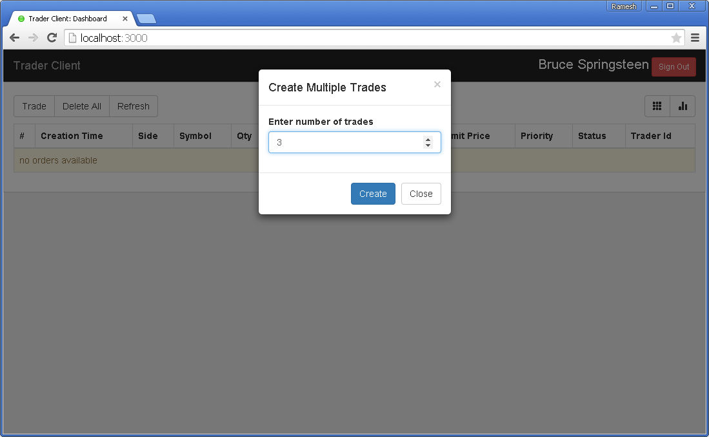
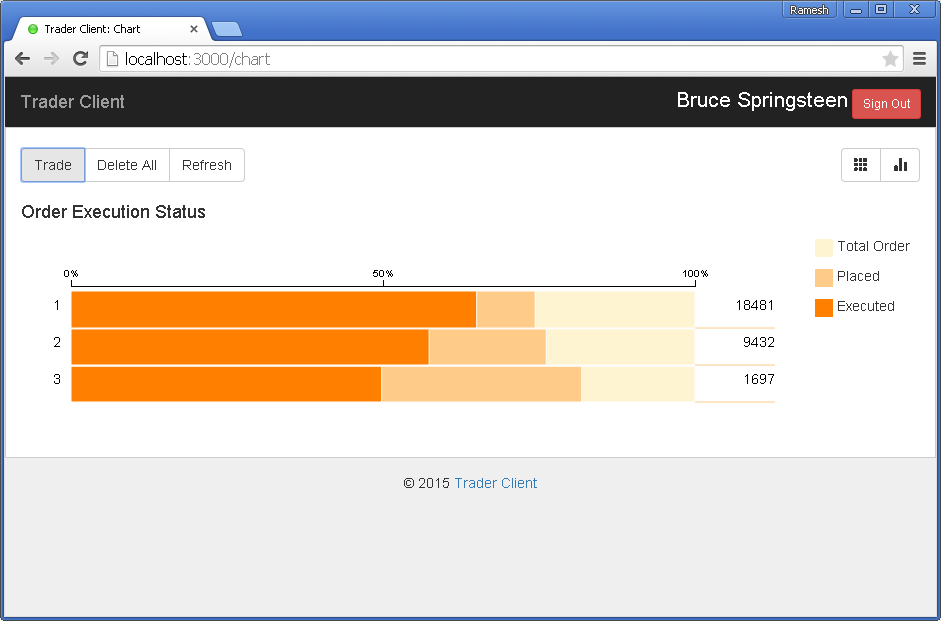

# Trader Client
This is the client web application for [Trader Desktop] (https://github.com/archfirst/trader-desktop), a simple mock server for trading platform.
This webapp developed with help of [AngularJs Template] (https://github.com/archfirst/angular-template). ***Learning exercise***.

## Requirements
- Install Node
    - on OSX, install [home brew](http://brew.sh/) and type `brew install node`
    - on Windows, use the installer available at [nodejs.org](http://nodejs.org/)
    - On OSX you can alleviate the need to run as sudo by [following John Papa's instructions](http://jpapa.me/nomoresudo)
- Open terminal
- Type `npm install -g node-inspector bower gulp`

## Quick Start
Clone this repo and run the content locally:
```bash
$ npm install
$ gulp serve-dev
```
- `npm install` will install the required node libraries under `node_modules`. Also, it will trigger `bower install` to install the required client-side libraries under `bower_components`.
- `gulp serve-dev` will serve up the Angular application in a browser window.

Few Screenshots
---------------

#### Login Screen


#### Dashboard


#### Trade Dialog


#### Dashboard with Orders


#### Dashboard - Mobile View


#### Chart View


#### Chart View (Responsive)


#### Chart - Mobile View


##### Note
Make sure you have "bower_components\socket.io-client\bower.json" file, which was not available in original repo.

