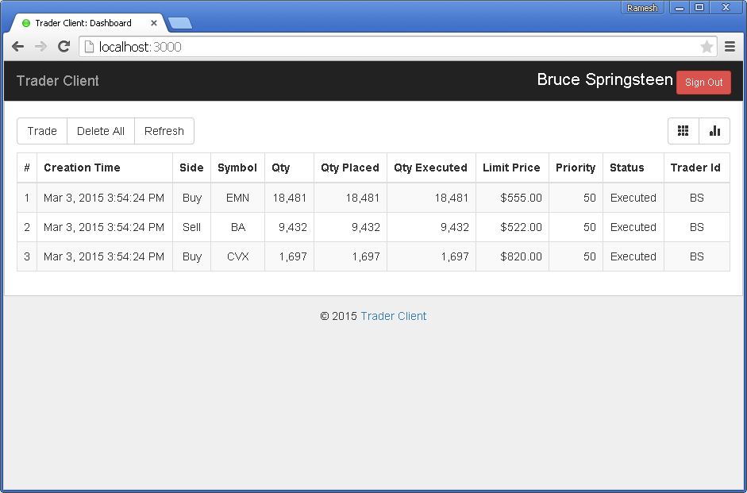

# Trader Client
This is the client web application for [Trader Desktop] (https://github.com/archfirst/trader-desktop), a simple mock server for trading platform.
This webapp developed with help of [AngularJs Template] (https://github.com/archfirst/angular-template). ***Learning exercise***.

## Quick Start
Clone this repo and run the content locally:
```bash
$ npm install
$ bower install
$ gulp serve-dev
```
- `npm install` will install the required node libraries under `node_modules`.
- `bower install` will install the required client-side libraries under `bower_components`.
- `gulp serve-dev` will serve up the Angular application in a browser window.

Few Screenshots
---------------

#### Login Screen


#### Dashboard


#### Trade Dialog


#### Dashboard with Orders


#### Dashboard - Mobile View


##### Note
Make sure you have "bower_components\socket.io-client\bower.json" file, which was not available in original repo.

